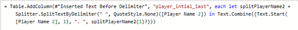
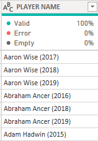
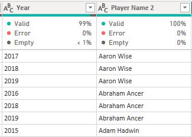
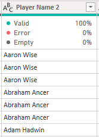
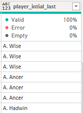
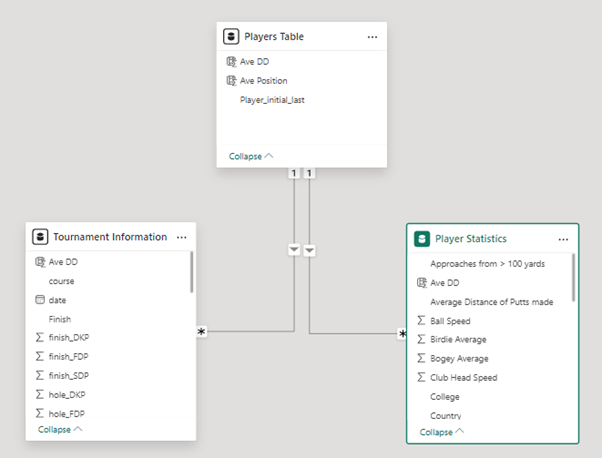
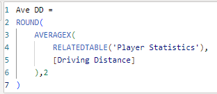
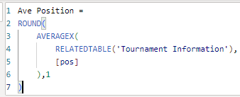

# BPP Data-Science-Portfolio

# PGA Tour Golf Data Project

## Executive Summary

This project looks at data from the professional sport of golf, specifically the elite tour in America, the PGA (Professional Golf Association) Tour.

I am going to look at how important the 1st shot off the tee on each hole is, by looking to see if the ball distance off the tee has a correlation to overall performance. This 1st shot is known as ‘the drive’ and so you will see me refer to this metric in the report as ‘driving distance’.

My hypothesis is that if you hit the ball further off the tee with the 1st shot, this will lead to lower scores on the hole overall, which in turn results in a lower score of the tournament. The significance of this is the player with the least number of shots wins the tournament. 

I will use regression analysis technique to highlight any correlations. I also plan to do some time series analysis to see if there are any changes over the 8 years of data that I have. 

I have researched the use of linear regression from (Linear regression. Su, X et al. 2012.) 

## Data Infrastructure and Tools

I have managed to download public data sets taken from all the PGA tour tournaments over 8 years (seasons) from the website Kaggle.

The files are .csv files, which are easy to ingest into my chosen analytics tool Microsoft Power BI. These types of data files are classed as structured data because they are already formatted in a table using columns with pre-defined field names and are easier to use than other sources like unstructured data which can include pictures or information within PDF files where the data is more difficult to extract and analyse.  

There are 3 data sets in total, because I couldn’t find a single dataset that had everything I required. This means that I had to join the data using star schema in Power BI. All data sets were ingested individually and then I explored the data to see how to make the joins on the 3 tables. 

After exploring the 3 datasets using the table visualiser in Power BI, I concluded that I could get everything I needed from just 2 of the tables, The Tournament Information and The Player Statistics data tables. 

## Data Engineering

I have a dataset that contains individual players statistics over the seasons and another with all the tournament information over seasons. These are both .csv files that I have ingested into Power BI using the Power Query Editor tool. 
The reason for using Power BI is for its strong ability to engineer data using M-code within the editor tool and the large variety of visuals available to showcase the data on a dashboard.  

I’ve linked the datasets using player name as the primary key. 

There was a challenge with this as 1 dataset used the players full name along with the year and another used the first initial and surname. 

E.g. Rory McIlroy (2019) and R.McIlroy  

Firstly, I removed the year and put this into a new column using this code:

 

Then I put the player name into another column:

 

Then I did a transformation of the full player name to just initial and surname:
 
 

Before:                                                             After:
                    

Before:                                                             After:
                    

Because there are duplicate players fort each year, I chose to create a unique players table that I could use to connect to my 2 information tables using the primary key that I created. To create this table, I used the following DAX code:
  

This meant I could have my 2 information tables connect to a reference table to create a star schema data table design. See below:
 

The table relationships are the ‘many to one’ joining type, this enables me to aggregate date at an individual player level. 
The 2 pieces of data that I wanted to aggregate are the average player driving distances from the player statistics table and the player finishing positions from the tournament information table. 

I used the following DAX queries to create calculated columns within my player’s table. 

Ave DD (average driving distance) :
 

Ave Position (average finishing position)
 

## Data Visualisations & Dashboards

My completed dashboard visual can be seen here:

I have added a clear title and included the tour logo, which would be well recognised by anyone who follows the sport. I chose to use a dark green and gold colour scheme; this relates to the flagship competition on the tour ‘The Masters’ which is held once a year.  

 

I have chosen to firstly do some lineal regression analysis using my 2 variables of driving distance and tournament finishing position. The visual in Power BI that allows me to do this is a scatter chart. 
This chart allows you to plot 2 variables over the x and y axis to see if there is any correlation. 
 
The reason for choosing this chart is that you can then get the visual to plot a line to show any relationship trend between the 2 variables. This allows the audience to easily conclude the data without having to analyse the information themselves.

To aid the audience I’ve also included a matrix table visual, that allows me to show the audience the values for each player that is being plot onto the chart. I chose this visual because I can sort the data from lowest to highest average finishing position. Another reason for this visual was that I can use conditional formatting to highlight where the driving distance data exceeds 300 yards. I come onto the significance of this in my data analytics section.
 

I’ve also included 2 filters so that the report user can change the visuals to look at specific seasons or tournaments.

## Data Analytics

To begin with after I had ingested my datasets, I did some exploratory data analysis, looking at the raw tables to sense check the content and more importantly the statistics. I already have a good understanding of this sport so I know what type of range the metrics should be within, so anything that didn’t look correct would stand out to me. 
The datasets combined include 38k rows of information, so to make sense of this, I’ve used average calculations to show each player’s driving distance and tournaments finishing positions. 

When doing the linear regression analysis, I could see overall from the 8 years of data that there was a positive correlation between how far a player can hit the ball with the tee shot and their finishing positions in the tournaments. The trendline shows that the further you can drive the ball (y-axis) the more likely you are to finish in the higher finishing positions (x-axis).
Each marker on the scatter chart represents a unique individual player. 

  
 
This is backed up by the player ranking tables where I have sorted the players by the average finishing position by descending. I’ve then used conditional formatting to highlight the average driving distances over 300 yards. See table extract below showing the top 15 players, 11 (73%) of which have a driving distance over 300 yards.
 

When completing this analysis, I thought it was also work while looking at the trend of driving distance over time. When taking all players and averaging the total driving distance over seasons, we can so an increasing trend over time. This shows that the players are aware of the importance of this 1st shot off the tee and have trained to hit it longer. The chart below represents the times series analysis of this metric.
 

This information can be used to present to any new players looking to compete at the highest level and can make them aware of the importance of driving the ball long. This can then get them to focus their training on the driving shot and steer them to work in the gym on certain muscle groups to aid them to increase their driving statistics.  

